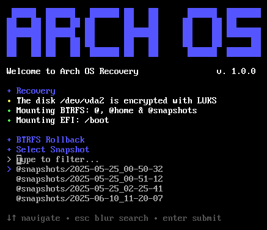

<h1 align="center">
  
  
Arch OS Recovery

</h1>

<strong>Boot from official <a target="_blank" href="https://github.com/murkl/arch-os#1-prepare-bootable-usb-device">Arch ISO Device</a> and run</strong>

**`curl -Ls bit.ly/arch-os-recovery | bash`**

  
A recovery script for Arch OS that handles LUKS2 encryption, repairs ext4 filesystems, and restores Btrfs snapshots automatically. It simplifies system recovery after failures by unlocking, repairing, and rolling back snapshots with minimal user input.

  

    
    
  

  
100% shellcheck approved

  
powered by <a href="https://github.com/murkl/arch-os">Arch OS</a>

